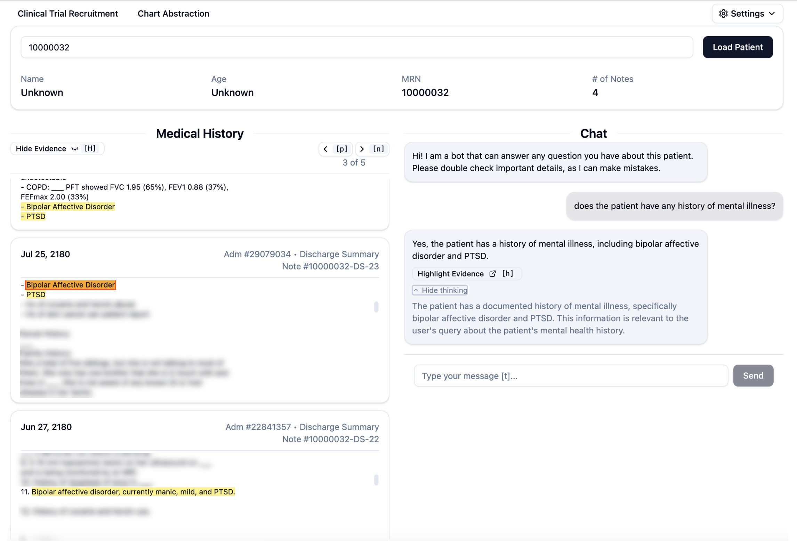

# EHR-LLM

A tool for using LLMs for chart abstraction + review.



Supported datasets:
1. MIMIC-IV
1. n2c2 2018 clinical trial matching
1. `[TODO]` STARR-OMOP

Supported model providers:
1. Ollama (local)
1. Litellm (remote)
1. SHC Azure (remote)

## Usage

```bash
conda activate ehrllm

# Python backend
cd ehrllm/backend && python3 wsgi.py

# React frontend
cd ehrllm/frontend && npm run dev
```

## Installation

```bash
conda create -n ehrllm python=3.10 -y
conda activate ehrllm

# Python backend
pip install -e .

# React frontend
cd ehrllm/frontend
npm install
```

## Data

### MIMIC-IV

Download data from [MIMIC-IV Notes](https://www.physionet.org/content/mimic-iv-note/2.2/):

```bash
# Download notes
wget -r -N -c -np --user miking98 --ask-password https://physionet.org/files/mimic-iv-note/2.2

# Unzip .csv.gz files
cd mimiciv/physionet.org/files/mimic-iv-note/2.2/note
for file in *.csv.gz; do
    gunzip "$file"
done
```

### n2c2 2018 CT Matching

Download from [this link](https://portal.dbmi.hms.harvard.edu/projects/n2c2-nlp/).